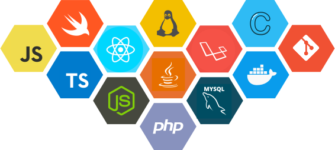

<h1 align="center">hello world , I'm Tairone Dias</h1>
<h3 align="center"><em style="font-style: italic">"Everybody in this country should learn how to program a computer... because it teaches you how to think!" (Steve Jobs)</em></h3>

 
<!-- 
  
 -->

### 🤵 About Me:

- 🎓 Computer Engineering at <a href="https://ufrb.edu.br/portal/"><b>UFRB</b></a>

- 👩🏻‍💻 Full Stack Developer at <a href="https://conexa.app/"><b>Conexa</b></a>

- 📌 Current working with PHP, jQuery and Bootstrap

- 🌱 I’m currently learning: <b>Node.js, ReactJS and React Native</b>

- 💻 Website - [taironedias.github.io/me](https://taironedias.github.io/me)

- 🇧🇷 Living in Brazil

- ⚡ My store in [Google Play](https://play.google.com/store/apps/developer?id=DiasDevelopers)

- 📫 How to reach me: 
    - LinkedIn: [@tcdias](https://linkedin.com/in/tcdias)
    - Twitter: [@taii_d](https://twitter.com/taii_d)

 
<h2 align="center">Languages and Tools</h2>
 
<h3 align="center">
</h3>

<!-- 
  
 -->

 
<h2 align="center">My Github stats:</h2>
 

&nbsp;

